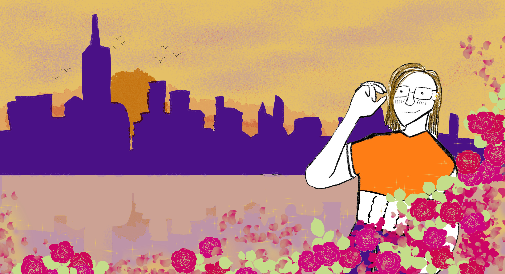

# SaveTheDate 💖✨🌹

  

*Your heart is aflutter, but you will not falter! You've gotta make it count on your one-and-only chance with a hunky hottie you met online - this date must be perfect, and really, what could go wrong?* 💕💫

---

## Credits 🎨🎵💻

| Role          | Team Members                     |
|---------------|----------------------------------|
| Team Lead     | Alex Hernandez                   |
| Programming   | Sagar Patel, David Jones         |
| Sound Design  | Alireza Esna-Ashari, Sagar Patel |
| Art           | Jake Hitchcock, Alex Hernandez   |

---

## How to Play 🎮🌟

- Play the game directly on this page or download it for your platform. 🖥️💾
- If you choose to download it, simply extract the zip file and run the executable. 📁🚀
- On the main menu, click the "help" button for the full list of controls. ℹ️🎮
- Enjoy your date! 💖🌹😍

---

## Links 🔗💻

- Play the game on [itch.io](https://jalexhdez.itch.io/save-the-date). 💻🎮
- Play the game online via [GitHub Pages](https://sagarpatei.github.io/Save_The_Date/). 🌐✨

---

  

---

## Honorable Mentions

This project includes the use of royalty-free sound effects from [Freesound.org](https://freesound.org), with special thanks to:

- ["Tearing Apart a Juicy Lemon.wav"](https://freesound.org/people/CheatinSloth/sounds/738788/) by [CheatinSloth](https://freesound.org/people/CheatinSloth/)  
- ["NYC ambient subway station and train approach.wav"](https://freesound.org/people/Vortichez/sounds/335230/) by [Vortichez](https://freesound.org/people/Vortichez/)  
- ["subway - downtown local 6 announcement.wav"](https://freesound.org/people/taknation/sounds/123904/) by [taknation](https://freesound.org/people/taknation/)
